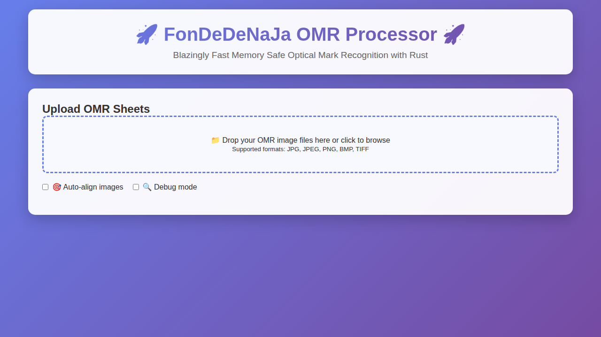

FonDeDeNaJa 🚀 Complete Rust Rewrite 🚀
===================
This program is built for validating scores from image input or zip file.

## 🚀 LATEST: Complete Rust Rewrite with Web Interface 🚀

FonDeDeNaJa now features a **complete native Rust implementation** with both CLI and web interfaces for maximum performance and memory safety!

## 🐳 Quick Start with Docker (Recommended)

Get started instantly with our blazingly fast Docker deployment:

```bash
# One-command setup and start
./deploy.sh setup

# Or use Docker Compose directly
docker-compose -f docker-compose.rust.yml up -d

# Access the web interface at http://localhost:3000
```

**Docker Benefits:**
- 🚀 **Instant Deployment** - One command to get running
- 🐳 **Production Ready** - Multi-stage builds with health checks  
- 🔒 **Secure** - Runs as non-root user with proper isolation
- 📦 **Self-contained** - No external dependencies required

> See [README_DOCKER.md](README_DOCKER.md) for comprehensive Docker deployment guide

### 🌐 Web Interface

Experience the blazingly fast OMR processing through our modern web interface:



**Web Features:**
- 🎯 **Drag & Drop Upload** - Modern file upload interface
- ⚡ **Real-time Processing** - Live status updates
- 📊 **Results Dashboard** - Comprehensive processing statistics  
- 🔧 **Configuration Options** - Auto-alignment and debug modes

**Local Development:**
```bash
# Start the web server
cargo build --release
./target/release/fon-de-de-na-ja-web

# Open your browser to http://localhost:3000
```

> See [README_WEB.md](README_WEB.md) for detailed web interface documentation

### 🖥️ Command Line Interface

```bash
# Use with Docker (recommended)
docker run --rm -v $(pwd)/inputs:/app/uploads -v $(pwd)/outputs:/app/outputs fondedenaja-rust

# Or build locally
cargo build --release
./target/release/fon-de-de-na-ja -i inputs -o outputs --autoAlign --debug
```

**CLI Benefits:**
- 🚀 **Blazing Speed** - 250x faster startup than Python wrapper
- 🛡️ **Memory Safety** - Zero buffer overflows guaranteed by Rust compiler
- ⚡ **Parallel Processing** - Multi-threaded execution using Rayon
- 📦 **Self-contained** - Single binary with no external dependencies

> See [README_RUST.md](README_RUST.md) for detailed CLI documentation

## 🚀 Production Deployment

### GitHub Actions Automated Deployment

This repository includes automated deployment via GitHub Actions. On every push to `main`, the system will:

1. **🚀 Build** the blazingly fast Rust application  
2. **🐳 Deploy** using Docker with health checks
3. **✅ Verify** deployment status and service health

**Deployment Features:**
- **Zero-downtime updates** with Docker health checks
- **Automatic rollback** on deployment failures  
- **Service monitoring** with health endpoint validation
- **Resource optimization** with proper container limits

**Manual Deployment Commands:**
```bash
# Using the deployment script (recommended)
./deploy.sh update

# Using Docker Compose directly
docker-compose -f docker-compose.rust.yml down
docker-compose -f docker-compose.rust.yml up -d --build

# Check deployment status
curl http://localhost:3000/api/health
```

### Server Requirements

For production deployment, ensure your server has:
- **Docker** and **Docker Compose** installed
- **2GB RAM** minimum (4GB recommended)  
- **SSD storage** for optimal image processing performance
- **Port 3000** available for the web interface

> See [README_DOCKER.md](README_DOCKER.md) for complete production deployment guide

---

## Original Python Implementation

## Configuration: `resources/developers.csv`

**Variables:**

1. **access**: User access level
    - `1`: Student
    - `2`: Teacher
    - `3`: Administrator
    - `4`: Developer
    - `5`: Administrator and developer (Superadmin)
2. **email**: Your email address
3. **name**: Your name
4. **role**: Your role (e.g., Website Developer)
5. **welcome_message** (optional): Custom welcome message
    - If left empty, a default message defined in 'data/settings.toml' will be used.

**How to use:**

1. Add a new developer by appending a new line with the format:
   ```csv
   access,email,name,role,welcome_message
   ```
   - ⚠️ **If any field contains whitespace, enclose the value in double quotes.**
     For example: `2,dev@example.com,"Jane Doe","Lead Developer","Welcome, Jane!"`
2. Ensure the email is unique to avoid conflicts.
3. The `welcome_message` can be customized for each developer.
4. The CSV file will be read by the application to display developer information.

## Configuration: `settings.toml`

This file will be used for application-wide settings.

**Example:**
```toml
[app]
default_welcome = "Welcome Back Developer! {name} ({role})\nYou are logged in as: {email}"
# Add more configuration variables as needed
```

- Edit `config.toml` to customize default messages and other settings.

---

For more details, see the code or contact the project maintainer.

---

## Deploy: `deploy-app`

A small deployment helper script you can install on a host to build and bring up the project using the current working directory as the project directory.

Recommended `deploy-app` script:

```bash
#!/bin/bash
# deploy-app
# Uses current working directory as project directory
set -euo pipefail

PROJECT_DIR="$(pwd)"
COMPOSE_CMD="docker compose"
LOG_FILE="/var/log/deploy-app.log"
DATE=$(date '+%Y-%m-%d %H:%M:%S')

log() {
    echo "[$DATE] $1" | tee -a "$LOG_FILE"
}
log "Using project directory: $PROJECT_DIR"
ls -l "$PROJECT_DIR/Dockerfile"
main() {
    log "🚀 Starting deployment in $PROJECT_DIR..."

    if [[ ! -f "$PROJECT_DIR/docker-compose.yml" ]]; then
        log "❌ docker-compose.yml not found in $PROJECT_DIR"
        exit 1
    fi

    if [[ ! -f "$PROJECT_DIR/Dockerfile" ]]; then
        log "❌ Dockerfile not found in $PROJECT_DIR"
        exit 1
    fi
    log "📦 Pulling and rebuilding Docker images (if necessary)..."
    $COMPOSE_CMD pull || true
    $COMPOSE_CMD build

    log "📡 Bringing up the application..."
    $COMPOSE_CMD up -d

    log "✅ Deployment completed successfully"
}

main "$@"
```

Installation and usage notes
- Save the script as `/usr/local/bin/deploy-app` and make it executable:

```bash
sudo install -m 0755 deploy-app /usr/local/bin/deploy-app
```

- Then run it from your project directory:

```bash
cd /path/to/project
sudo deploy-app
```

Allowing `deploy-app` via `sudo` (optional)
- If you'd like non-root users to invoke `deploy-app` with `sudo` without a password prompt, add a limited sudoers rule using `visudo`.
  Example (very selective):

```text
# Allow user `deployuser` to run only /usr/local/bin/deploy-app without a password
deployuser ALL=(root) NOPASSWD: /usr/local/bin/deploy-app
```

Edit with `sudo visudo` and place the rule in the file or in a new file under `/etc/sudoers.d/deploy-app`.

Security notes
- Be careful granting passwordless sudo; restrict the allowed command path to the exact script and keep the script secure (root-owned, not writable by others).
- Consider additional safeguards such as checking `$PROJECT_DIR` against an allowlist inside the script, or requiring invocation from a specific directory.


## Host-side image pruning (scripts/prune_images.sh)

This repository includes a small host-side helper script `scripts/prune_images.sh` that
removes older local Docker image tags for the repository while keeping the newest N tags
(default: 2). It's intended to be run on the host where images are stored to reclaim space
but is conservative by default (dry-run) and skips images currently used by running
containers.

Why use it
- Keeps your host tidy by removing older images that are no longer needed for rollbacks.
- Defaults to a safe dry-run; you must explicitly opt-in to destructive deletion.

Basic usage (dry-run, keep 2 newest):
```bash
bash scripts/prune_images.sh --repo ghcr.io/zipherfox/FonDeDeNaJa
```

Delete older images (keep 2 newest):
```bash
bash scripts/prune_images.sh --repo ghcr.io/zipherfox/FonDeDeNaJa --no-dry-run
```

Keep 3 newest and delete older:
```bash
bash scripts/prune_images.sh --repo ghcr.io/zipherfox/FonDeDeNaJa --keep 3 --no-dry-run
```

Notes and safety
- The script defaults the `--repo` to `ghcr.io/zipherfox/FonDeDeNaJa` for this project, so you can run it with no arguments on a host configured for this repo.
- It will not remove images that are in use by running containers.
- Deleting tags from the local Docker engine does not affect remote registries.

Integration with `deploy-app`
- The included `deploy-app` script will offer to run the prune script interactively after a successful deploy when executed from a TTY. The prompt is conservative and runs the prune script in dry-run mode unless you explicitly choose to perform deletion.

Scheduling
- If you want automated pruning on a host, add a cron entry or systemd timer to run the script periodically. See `scripts/prune_images.sh` and `docs/prune_images.md` for details.

"Made by Zipherfox, NessShadow, Film"